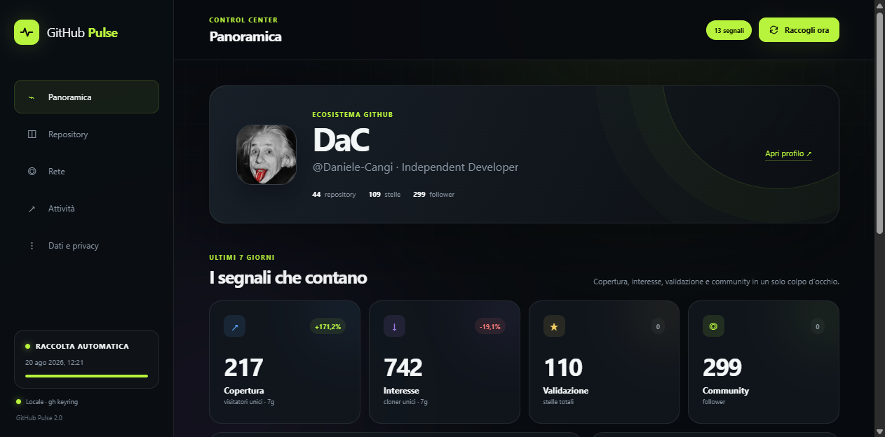
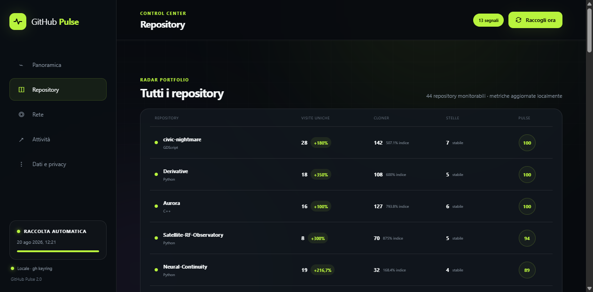

# GitHub Pulse

### Your local-first GitHub intelligence dashboard

Turn repository traffic, stars, clones, activity and community changes into signals you can actually use.

GitHub Pulse is a self-hosted control center for the account currently active in
[GitHub CLI](https://cli.github.com/). It runs on your computer, reads GitHub
through the authenticated <code>gh</code> session and stores historical data in
a local SQLite database.

There is no username to configure and no token to paste into the app.

## What you get

| Area | What it shows |
| --- | --- |
| **Overview** | Reach, interest, validation, community trends and important signals |
| **Repositories** | Portfolio ranking, unique visitors, clones, referrers and popular pages |
| **Stars** | Timestamped stargazer timeline for repositories you can access |
| **Network** | Followers, following, mutual relationships and changes over time |
| **Activity** | Recent public events and an experimental Achievement Lab |
| **Data** | Daily collection status, CSV exports and a complete JSON backup |

## Designed for every GitHub account

GitHub Pulse automatically runs:

~~~powershell
gh api user
~~~

to identify the active account. Each account gets an isolated database:

~~~text
data/github-pulse-<github-login>.sqlite3
~~~

If you use more than one GitHub account, switch the active <code>gh</code>
account and restart GitHub Pulse. Existing histories remain separate.

## Requirements

- Python 3.10 or newer;
- [GitHub CLI](https://cli.github.com/) installed and authenticated;
- write access to repositories whose traffic metrics you want to inspect.

No Python packages need to be installed. The application uses only the standard
library, GitHub CLI and SQLite.

## Quick start

Clone the repository and enter the project directory:

~~~powershell
git clone https://github.com/Daniele-Cangi/GitHub-Pulse.git
cd GitHub-Pulse
~~~

Verify the active GitHub account:

~~~powershell
gh auth status
~~~

Start the dashboard:

~~~powershell
python app.py
~~~

On Windows you can also double-click <code>start.cmd</code> or run:

~~~powershell
.start.ps1
~~~

GitHub Pulse opens at [http://127.0.0.1:8765](http://127.0.0.1:8765). Press
<code>Ctrl+C</code> in the terminal to stop it.

## How collection works

GitHub exposes repository views and clones for the latest 14 days. GitHub Pulse
persists every available day in SQLite, building a history that can extend
beyond GitHub's window.

While the server is running, a complete collection starts when the previous one
is more than 20 hours old. You can also start it manually with **Raccogli ora**.
Non-archived repositories are processed sequentially to keep API usage
predictable.

The interface is currently in Italian; account detection and stored data are
fully account-independent.

Follower and following lists do not include timestamps. GitHub Pulse therefore
creates a baseline on first run and records additions or removals from subsequent
snapshots.

## Privacy and security

- The HTTP server binds to <code>127.0.0.1</code> by default.
- Tokens never enter the browser or the SQLite database.
- Authentication remains in the operating system keyring managed by GitHub CLI.
- Collected databases are ignored by Git and stay on the local machine.
- CSV and JSON exports are generated only when requested.

## GitHub API limits

GitHub does not expose:

- unique visitors to a personal profile;
- the identity of people who clone a repository;
- a direct visitor-to-clone conversion path;
- an official API for every achievement already displayed on a profile.

Clone-to-visitor percentages in the interface are aggregate indicators, not
individual conversions. Achievement cards are eligibility estimates and not an
authoritative badge record.

## Architecture

~~~text
Browser
   │
   ▼
Python local server ─── SQLite history
   │
   ▼
GitHub CLI / OS keyring
   │
   ▼
GitHub REST API
~~~

The frontend is plain HTML, CSS and JavaScript. The backend is a single Python
application with no framework or package-manager dependency.

## Development

Run the test suite:

~~~powershell
python -m unittest discover -s tests -v
~~~

Useful local endpoints:

~~~text
GET  /api/health
GET  /api/dashboard
GET  /api/signals
GET  /api/activity
GET  /api/traffic?repo=OWNER/REPO
POST /api/collect
GET  /api/export?dataset=summary
~~~

## License

GitHub Pulse is open-source software released under the
[MIT License](LICENSE). You can use, modify and distribute it, including in
commercial projects, while retaining the copyright and license notice.

---

Built to make GitHub activity readable, not merely countable.

